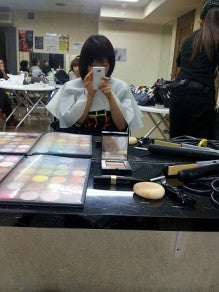

# いーまはまだーこーえを聞かせて  
# Ima wa mada— koe o kikasete  
# Sekarang, dengarkanlah suaraku

2011-11-07 21:50:31  

yo！  
Yo!

ライブ終わったあとって寂しい、寂しい  
Raibu owatta ato tte sabishii, sabishii  
Setelah konser berakhir, rasanya sepi, sepi sekali.

急にまわりから人がいなくなるとうああああああってかんじ。  
Kyū ni mawari kara hito ga inakunaru to uaaaaaa tte kanji.  
Ketika orang-orang di sekitarku tiba-tiba menghilang, rasanya seperti, "Uaaaa."

メイクしてもらってちょっとおもしろかった(笑)  
Meiku shite moratte chotto omoshirokatta (warai)  
Dibuatkan makeup itu agak lucu (tertawa).

高倉さんもTONYさんも立花さんも素敵です  
Takakura-san mo TONY-san mo Tachibana-san mo suteki desu  
Takakura-san, TONY-san, dan Tachibana-san semuanya luar biasa.

すんばらしい。  
Sunbarashī.  
Sungguh hebat.

１月たのしみです  
Ichigatsu tanoshimi desu  
Aku menantikan bulan Januari.

福岡勢で賞独占だぜ！ふぉう！  
Fukuoka-zei de shō dokusen da ze! Fou!  
Kami akan mendominasi penghargaan dengan tim dari Fukuoka! Fuh!

さらだばー。  
Saradabā.  
Sayonara!

Source: [Ameba](https://ameblo.jp/arihara6/entry-11072070848.html)