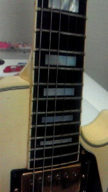
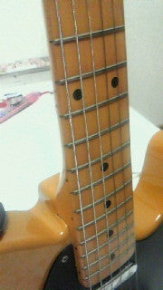
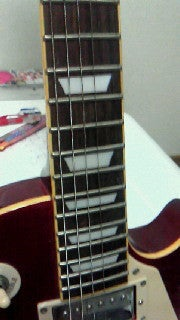

# 乳製品のえぶりでい  
# Nyūseihin no eburidei  
# Setiap hari dengan produk susu

2011-09-25 09:23:48  

チーズ  
Chīzu  
Keju

ヤクルト  
Yakuruto  
Yakult

ヨーグルト  
Yōguruto  
Yogurt

カルピス  
Karupisu  
Calpis

こんなもんばっか食って生活しております  
Konna mon bakka kutte seikatsu shite orimasu  
Saya hidup hanya makan hal-hal seperti ini

あと野菜生活と野菜1日これ一本の大きい紙パックのやつを  
Ato yasai seikatsu to yasai ichinichi kore ippon no ōkī kami pakku no yatsu o  
Dan juga minum jus sayuran dan minuman sayuran sehari satu dalam kotak kertas yang besar

1日で飲み干してしまう。  
Ichinichi de nomihoshite shimau.  
Saya habiskan dalam sehari.

お腹壊すよ！おそろし！  
Onaka kowasu yo! Osoroshi!  
Perutku sakit! Mengerikan!

無駄に更新欲が湧くね  
Muda ni kōshin yoku ga waku ne  
Saya merasa ingin memperbarui blog ini tanpa alasan

ほっほっ  
Ho ho  
Ho ho

定期的にソラニン見たくなる病。  
Teikiteki ni Solanin mitaku naru byō.  
Saya punya penyakit yang membuat saya ingin menonton *Solanin* secara berkala.

でもみたら勉強できない  
Demo mitara benkyō dekinai  
Tapi kalau menontonnya, saya tidak bisa belajar

そして最近  
Soshite saikin  
Dan akhir-akhir ini

エレキギターのフレットを至近距離で見ると脈拍数があがります  
Erekigitā no furetto o shikinkyori de miru to myakuhakusu ga agarimasu  
Melihat fret gitar listrik dari dekat membuat detak jantung saya naik

要するに興奮します  
Yōsuru ni kōfun shimasu  
Singkatnya, saya sangat bersemangat

まいぎたーのふれっと  
Mai gitā no furetto  
Fret gitar saya

おわり←  
Owari ←  
Selesai ←

数学漬けのえぶりでいしてくる  
Sūgaku dzuke no eburidei shite kuru  
Saya akan kembali tenggelam dalam matematika setiap hari

Source: [Ameba](https://ameblo.jp/arihara6/entry-11028826241.html)